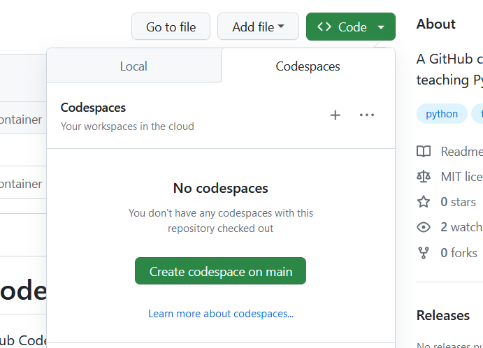

# Template Teaching Python Codespaces

This repository is a template repository for creating a GitHub Codespaces instance with a minimal Python setup.

## For instructors

It is recommended that instructors fork this repository and make adjustments to the [README.md](./README.md) as required for your course. 
- [ ] Change the link in [Getting started](#getting-started) step 2 so that the fork link points to your lesson repository
- [ ] Add to the README.md any lesson specific links or notes required
- [ ] Add any lesson specific files (requirements.txt, notebooks) to your fork
- [ ] (optional) Remove this [For instructors](#for-instructors) section 
- [ ] Share your lesson specific fork with attendees

## Getting started

1. To get started with this repository you need to have a [GitHub Account](https://github.com/signup)
2. [Fork](https://github.com/ARCTraining/teaching-python-codespace/fork) this repository to create your own personal copy
3. Start the Codespace: Select the Green Code icon > Codespaces tab > Create Codespace on main
    

